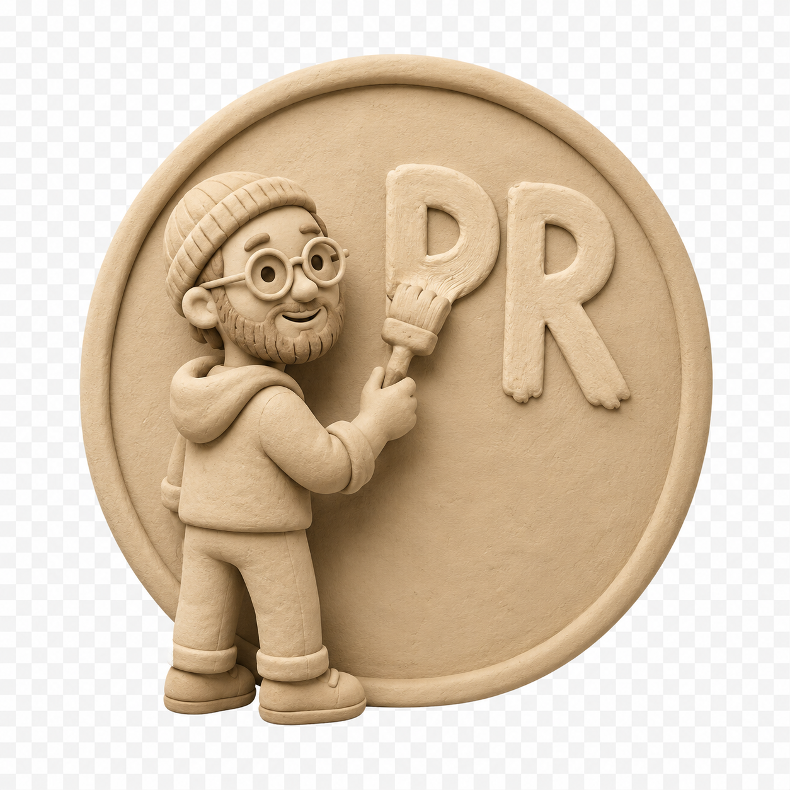

# Design-to-PR



Designers want to ship code. Designer want to collaborate with agents.
Codified design systems are the answer.

But it is hard to get started.

This is a starter repository that sets up a React-based design system for you, without knowing how to code.

You get a gallery to see and feel

- style guide
- components
- mockups

And you can create new components and mockups right in this repository.

To install this repository, check the docs/SETUP_INSTRUCTIONS.md
Then open `localhost:5173` to inspect the design system, component pages, mockups, and style guide.

## First-Time Setup

If you are setting this repo up for a client, give this to your coding agent:

```text
Help me set this up for this client. Follow docs/SETUP_INSTRUCTIONS.md.
```

this will guide you through the setup and launch the gallery for you.
In case you need or want to run this manually use the commands below.

To Run the local Gallery:

```bash
npm install
npm run dev
```


## Where Things Live

```text
docs/                   How to use this repository
client-design-system/   All client-specific design-system work
app/                    Localhost Gallery app
scripts/                Repo tooling
```

For the full map, see [`AGENTS.md`](AGENTS.md).

## Key Docs

- [`docs/SETUP_INSTRUCTIONS.md`](docs/SETUP_INSTRUCTIONS.md) - Guided first-time client setup.
- [`docs/README.md`](docs/README.md) - Repo documentation index.
- [`docs/glossary.md`](docs/glossary.md) - Shared terms.
- [`docs/designer-workflow.md`](docs/designer-workflow.md) - Designer workflow.
- [`docs/agent-workflow.md`](docs/agent-workflow.md) - Agent workflow.
- [`docs/repository-architecture.md`](docs/repository-architecture.md) - Architecture and source-of-truth model.

## Client Design System

Client-specific work belongs in [`client-design-system/`](client-design-system/):

- [`client-design-system/style-guide.md`](client-design-system/style-guide.md)
- [`client-design-system/catalog.json`](client-design-system/catalog.json)
- [`client-design-system/components/`](client-design-system/components/)
- [`client-design-system/mockups/`](client-design-system/mockups/)
- [`client-design-system/theme/`](client-design-system/theme/)

